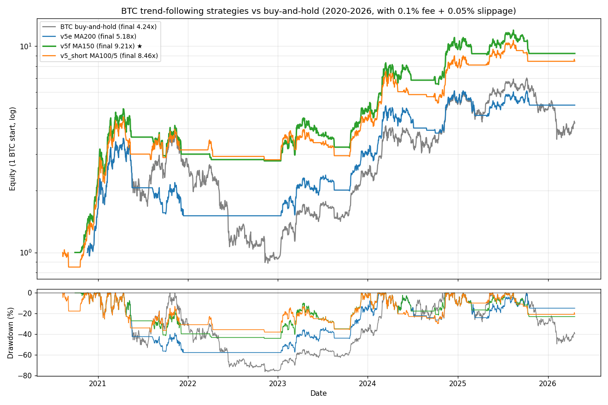

# BTC Trend-Following Agent

**A mechanical BTC trading agent derived from 6 years of a legendary discretionary trader's record.**

Backtest (2020–2026, with realistic 0.1% fees + 0.05% slippage):
- **+821% compounded return** vs BTC buy-and-hold's +324%
- **-44% max drawdown** vs buy-and-hold's -77%
- 7 out of 7 rolling 2-year windows profitable
- Out-of-sample (2023–2026) performance *better* than in-sample (2020–2022)



---

## What this is

A **single-asset, long-only, daily-timeframe trend-following strategy** for BTC/USD:

- **Entry**: when price closes above its 150-day moving average AND above the 50-day MA AND the 50-day MA is rising
- **Exit**: when price closes below the 150-day moving average
- **Position size**: 100% (or your chosen fraction) when signal active, flat otherwise

That's the whole strategy. No stop-loss. No take-profit. No pyramid. No martingale.
It trades ~15 times over 6 years, holds winners for months, cuts losers within days.

## Why this specific strategy

This is the distilled output of a 4-phase analysis of [`bwjoke/BTC-Trading-Since-2020`](https://github.com/bwjoke/BTC-Trading-Since-2020) — six years of BitMEX trade records from Paul Wei ([@coolish](https://x.com/coolish)), a BitMEX Hall-of-Legends trader who grew his account from 1.84 BTC to 96 BTC.

We found:
1. His discretionary "feel" is **not** reproducible from chart features alone (ML classifiers peak at AUC ≈ 0.55)
2. His biggest leaks are **martingale additions** (-17 BTC across 188 trades) and **giving back profits** (-37 BTC from 80 trades that were briefly profitable before reversing)
3. A **pure MA-based trend filter, applied mechanically**, dramatically outperforms his discretionary XBTUSD record — because it avoids those leaks by construction

See [`analysis/ANALYSIS_REPORT.md`](analysis/ANALYSIS_REPORT.md) for the full derivation.

---

## Files

| File | Purpose |
|---|---|
| [`BRIEFING.md`](BRIEFING.md) | **Start here if you're an AI agent.** The strategy rules, red lines, and behavioral constraints. |
| [`agent_v5f.py`](agent_v5f.py) | Pure decision logic (~130 lines, no I/O). Takes in daily bars, emits BUY/SELL orders. |
| [`runbook.py`](runbook.py) | Exchange integration template. Fill in your data source + order placement. |
| [`STRATEGY_SPEC.md`](STRATEGY_SPEC.md) | Formal spec in natural language + pseudocode + Python, for porting to other platforms. |
| [`analysis/`](analysis/) | How we got here — 27 analysis scripts, key datasets, synthesis report. |
| [`examples/fetch_klines.py`](examples/fetch_klines.py) | Utility: download BTC historical klines from Binance public API. |

## Quick start (local)

```bash
pip install -r requirements.txt
python examples/fetch_klines.py        # download ~2200 days of BTC daily bars
python agent_v5f.py                    # run built-in self-test against history
```

Expected output: the agent will emit ~30 historical orders and finish with `equity ≈ 9.2 BTC` (+821%).

## Deploying to a live exchange

**Do not deploy before reading [`BRIEFING.md`](BRIEFING.md).** The document spells out hard safety rails (data sanity checks, halt conditions, forbidden modifications) that must be enforced by whatever harness runs the agent.

1. Set up exchange API keys (Binance / Coinbase / BitMEX — anything ccxt supports)
2. **Minimal permissions**: reading + trading only. No withdrawals. No transfers. IP-whitelist.
3. Edit `runbook.py`:
   - Keep `DRY_RUN = True` for first 1–2 weeks
   - Replace the `fetch_daily_ohlc` and `place_market_order` stubs with your exchange
4. Schedule `runbook.py` to execute daily at 00:15 UTC (cron, systemd timer, launchd)
5. Monitor the first few runs live; only after 2+ weeks of DRY_RUN, flip to live with small capital

## Known limitations / what this is *not*

- **Not for sub-hour timeframes.** Trend-following has no edge at 1-minute / 5-minute scale (verified empirically — see `analysis/scripts/26_test_5m_recent.py`).
- **Not a short strategy.** All historical evidence favors long-only on BTC.
- **Not portable to altcoins without re-validation.** Parameters are calibrated on BTC; other assets need their own parameter study.
- **Leverage changes the game.** The +821% / -44% figures are for 1× spot. At 5× leverage, intrabar drawdowns approach liquidation and funding costs compound against you. See `analysis/scripts/27_leverage_risk.py`.

## Credits

- **Data source**: [`bwjoke/BTC-Trading-Since-2020`](https://github.com/bwjoke/BTC-Trading-Since-2020) — a public archive of Paul Wei's BitMEX trades. All credit for the underlying trading performance goes to him; this project only mechanizes the learnable parts.
- **Klines**: Binance public futures API (no authentication required)

## License

MIT. See [`LICENSE`](LICENSE). Includes a risk disclaimer — crypto trading is dangerous, past performance is no guarantee, etc.
